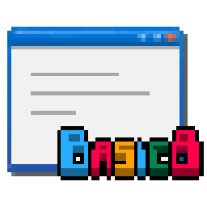
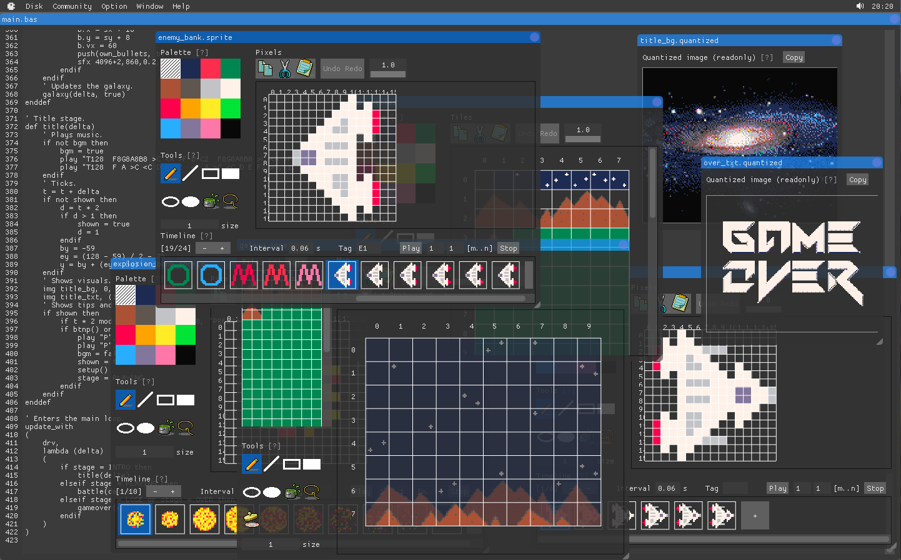
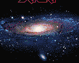
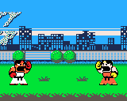
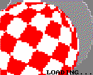
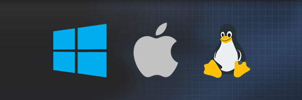
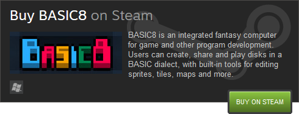

<head>
<link rel="shortcut icon" type="image/x-icon" href="favicon.ico">
</head>

## BASIC8

[Why BASIC8?](https://paladin-t.github.io/b8/pages/why) |
[Learning](https://github.com/paladin-t/b8/wiki) | [Manual](https://paladin-t.github.io/b8/docs/manual) | [Changelog](https://paladin-t.github.io/b8/docs/changelog) |
[Gallery](https://paladin-t.github.io/b8/pages/gallery) |
[About](https://paladin-t.github.io/b8/pages/about)

**Get BASIC8!**

| FANTASY | COMPUTER |
|----|----|
|  | BASIC8 is an integrated **Fantasy Computer** for game and other program development. You can create, share and play disks in a modern BASIC dialect, with built-in tools for editing sprite, tiles, map, quantized, etc. |

It's been a while since we used to enjoy coding and playing straightforward after a computer bootup. The goal of BASIC8 is bringing a sense of joy back from retro/vintage computing and gaming, also being quick at getting higher level stuff done for contemporary development for everyone.

### Technical specifications

* Display: 160x128 pixels
* Audio: 2 music channels, 4 sound effect channels
* Code: BASIC (structured/functional/prototype-based)
* Graphics: up to 65535 drawing commands per cycle
* Palette: 16 colors with transparency support
* Sprite: up to 32x32 pixels per frame, up to 512 frames per sprite
* Tiles: 240 cels
* Map: 128x64 tiles per layer, up to 4 layers (including a layer of logic mark) per page
* Gamepad: 6 buttons for each pad (D-Pad + A/B), up to 8 players
* Keyboard and mouse: supported

### Creative tools

BASIC8 provides built-in tools for editing sprite, tiles, map, quantized, etc. And extra tools as regular disks, such as the [Wave Maker](https://steamcommunity.com/sharedfiles/filedetails/?id=1352790993), [Player Maker](https://steamcommunity.com/sharedfiles/filedetails/?id=1328727512), [HTML Maker](https://steamcommunity.com/sharedfiles/filedetails/?id=1391948686). It's furthermore possible to [bring your own tools](https://steamcommunity.com/sharedfiles/filedetails/?id=1350153766), or [use plugins](https://github.com/paladin-t/b8.plugins).

### Shareable disks

See examples including [Cosmos Saga](https://paladin-t.github.io/b8/examples/Cosmos%20Saga/), [Infinity Fighter](https://paladin-t.github.io/b8/examples/Infinity%20Fighter/) and [Boing Ball](https://paladin-t.github.io/b8/examples/Boing%20Ball/).

  

BASIC8 disks can be handily shared via [Workshop](https://steamcommunity.com/app/767240/workshop/) with built-in [tools](https://paladin-t.github.io/b8/docs/workshop); saved as "`*.b8`" file, "`*.png`", or text based for sharing to other places.

### Redistributing

BASIC8 can be productive. Make redistributable [standalone player as executable binary](https://steamcommunity.com/sharedfiles/filedetails/?id=1328785409) with the [Player Maker](https://steamcommunity.com/sharedfiles/filedetails/?id=1328727512) for Windows, Mac OS X and Linux, and [standalone player as web page](https://steamcommunity.com/sharedfiles/filedetails/?id=1391950196) with the [HTML Maker](https://steamcommunity.com/sharedfiles/filedetails/?id=1391948686) for browsers.

### Get BASIC8

### System requirements

| | Minimum | Recommended |
|----|----|----|
| OS | Windows 7/8/10 (32/64bit)   MacOS X 10.7 or later (64bit)   Ubuntu (32/64bit) | CosmOS 1.0 |
| CPU | Atom 1.44GHz   Core 2 Duo 1.83GHz | Quantum |
| RAM | 512MB | 38911GB |
| GPU | Intel HD | Dark matter |

| Links | |
|----|----|
| Discuss | [Forums](https://steamcommunity.com/app/767240/discussions/) |
| Chat | [#basic8](https://discord.gg/phR38jm) [Fantasy Consoles](https://discord.gg/e4cpeuV) |
| Twitter | [@wangrenxin](https://twitter.com/wangrenxin) |
| Devlogs | [Steam discussion](https://steamcommunity.com/app/767240/discussions/9/) |
| Projects | [Tracking boards](https://github.com/paladin-t/b8/projects) |
