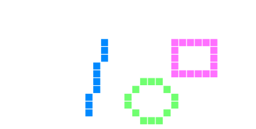

<!-- Do not use any undocumented or commented functions, they may be changed or removed. -->

## Welcome to BASIC8

Read this [manual online](https://paladin-t.github.io/b8/docs/manual)? Or read about [Workshop](workshop)?

BASIC8 is an integrated fantasy computer for game and other program development. Users can create, share and play disks in a BASIC dialect, with retro 8-bit style flavour, and some built-in tools for editing sprites, maps, sounds, etc.

It's encouraged to share your creativity. All disks are shared under the [CC-BY](https://creativecommons.org/licenses/by/4.0) license, if the author hasn't explicitly chosen other licenses. Every code, sprite, map and other data are viewable and editable to other users, it is recommended to learn and communicate with each other, also allowed to derive from other users' work or even cooperate together. The only community guidelines are just to be polite and respectful to other people and their work too; and, don't do anything bad.

You may read this manual in any order according to your interest, and open this to lookup for explanations at any time.

## Table of content

* Part I. Fundamental
	* [Getting started](#getting-started)
		* [Operations](#operations)
		* [Specifications](#specifications)
		* [Disk library](#disk-library)
		* [Configuration](#configuration)
		* [Sharing](#sharing)
			* [Exporter and importer](#exporter-and-importer)
			* [Disks](#disks)
			* [Recording GIF](#recording-gif)

* Part II. Syntax
	* [Basic principles](#basic-principles)
		* [Variable and data types](#variable-and-data-types)
			* [Number](#number)
			* [String](#string)
		* [Comment](#comment)
		* [Arithmetic and relational operations](#arithmetic-and-relational-operations)
		* [Bitwise operations](#bitwise-operations)
		* [String operations](#string-operations)
		* [Array](#array)
	* [Control structures](#control-structures)
		* [Conditional](#conditional)
		* [Looping](#looping)
		* [Jumping](#jumping)
	* [Advanced syntax](#advanced-syntax)
		* [Collections](#collections)
			* [Iterators](#iterators)
		* [Sub routine](#sub-routine)
			* [Variadic](#variadic)
		* [Lambda](#lambda)
		* [Class](#class)
		* [Typing](#typing)
		* [Importing another file](#importing-another-file)
		* [Coroutine](#coroutine)
		<!--* [Structured exception handling](#structured-exception-handling)-->
		* [Automatic memory management](#automatic-memory-management)
	* [Generic functions](#generic-functions)

* Part III. Game driver
	* [Graphics](#graphics)
		* [Primitives](#primitives)
		* [Sprite](#sprite)
		* [Map](#map)
		* [Quantized](#quantized)
	* [Input](#input)
		* [Mouse and touch](#mouse-and-touch)
		* [Gamepad](#gamepad)
		* [Keyboard](#keyboard)
	* [Audio](#audio)
		* [Music](#music)
		* [Sound effects](#sound-effects)

* Part IV. Editors
	* [Editors](#editors)
		* [Code](#code)
		* [Sprite asset](#sprite-asset)
		* [Map asset](#map-asset)
			* [Tiles asset](#tiles-asset)
		* [Quantized asset](#quantized-asset)

* Part V. Functions
	* [Basic functions](#basic-functions)
		* [Math functions](#math-functions)
		* [String functions](#string-functions)
		* [Data transfer and persistence](#data-transfer-and-persistence)
	* [Libraries](#libraries)
		* [Algorithm](#algorithm)
		* [Archive](#archive)
		<!--* [Asynchronization](#asynchronization)-->
		* [Bytes](#bytes)
		* [Database](#database)
		* [Date time](#date-time)
		* [File](#file)
		* [GUI](#gui)
		* [Image](#image)
		* [IO](#io)
		* [JSON](#json)
		* [Math](#math)
			* [Vector and matrix](#vector-and-matrix)
		* [Network](#network)
		* [System](#system)
		* [Text](#text)
		* [Web](#web)

* Part VI. Appendix
	* [Built-in sound fonts](#built-in-sound-fonts)
	* [Reserved words](#reserved-words)
	* [Type names](#type-names)

[HOME](#welcome-to-basic8)

# Part I. Fundamental

## Getting started

It's been a while since people used to enjoy coding and playing straightforward after a computer bootup. The goal of BASIC8 is to bring a sense of joy back from retro/vintage computing and gaming, also be quick at getting higher level stuff done. It's trying to stay at a balance point of simplicity, creativity, fun and usability.

### Operations

Most home computers from 1970-80s use keyboards as the only developer input method, but mouse and touch are everywhere nowadays. It's supported to use keyboard, mouse/touch and gamepad to play disks. But BASIC8 uses mouse as the main operation method on the GUI of editors; keyboard is mainly used to write code, and do some shortcuts:

* F1: show this manual
* F7: take a screenshot when playing
* F8: record frames when playing, or stop recording
* Ctrl+R: run a disk
* Ctrl+.: stop running a disk
* Ctrl+S: save all data
* Ctrl+Z/Ctrl+Y: undo/redo
* Ctrl+X: cut data
* Ctrl+C: copy data
* Ctrl+V: paste data
* W/S/A/D: select painting sources
* Z/X: select painting tools
* B/N: select active frame or layer

See tips in editors for other details.

When speaking of clicking `[Head]` in this document, it means the first icon item on the main menu bar:

### Specifications

The limitations of BASIC8 are carefully chosen to make it easy and simple during making programs:

* Display: 160x128 pixels
* Audio: 2 music channels, 4 sound effect channels
* Code: BASIC
* Graphics: up to 65535 drawing commands per cycle
* Palette: 16 colors with transparency support
* Sprite: up to 32x32 pixels per frame, up to 512 frames per sprite
* Tiles: 240 cels
* Map: up to 128x64 tiles per layer, up to 4 layers (including a layer of logic mark) per page
* Gamepad: 6 buttons for each pad (D-Pad + A/B), up to 8 players

### Disk library

All disks are stored in a library directory on hard disk, each disk has its own sub directory for all code and data. The default root path of library is:

* "C:/Users/YourName/Documents/BASIC8/" on Windows
* "/Users/YourName/Documents/BASIC8/" on MacOS
* "/home/YourName/Documents/BASIC8/" on Linux

### Configuration

There are some configurable options available:

* Maximizing the canvas when playing: `Option`, `Graphics`, checking `Maximize canvas`
* Hiding the menu bar when playing: `Option`, `Graphics`, checking `Hide menu bar when playing`
* Fixing the ratio of canvas size when playing: `Option`, `Graphics`, checking `Fix canvas ratio`
* Entering full screen: `Option`, `Graphics`, `Full screen` on Windows and Linux; click the `Maximize` button on MacOS
* Customizing input: `Option`, `Input`, then custom for each virtual gamepad on the dialog box
* Changing the root directory of library: `Option`, `Directory`, `Browse`, `Apply`, this will move all existing disks to the new path; **important notice**, if you are willing to move it, create a new empty directory as your new location, rather than choosing an existing one, BASIC8 will not create any empty sub directory
* Showing stat. information: `Option`, check `Show stat.`
* Making it running when double click on a disk, instead of opening it: `Option`, check `Run on click`
* Allowing multiple editor windows: `Option`, check `Multiple windows`

### Sharing

A big part of retro computing which makes it fun to work with is sharing and discussing user generated contents through magazines and other medias. It is convenient to export disk and record frames in BASIC8 for sharing.

#### Exporter and importer

To export a disk, select it on the main library screen, click `[Head]`, `Export`, then choose one of `Save "*.b8" file`, `Save "*.png" file`, and `Copy text based`; or right click on a disk, then click `Export` to open the dialog box. It packs all code, assets and customized data (*.data) in the content directory of a disk; but doesn't deal with sub directories.

To import a disk, click `[Head]`, `Import`, then choose one of `From a "*.b8" file`, `From a "*.png" file`, and `From text based`; you should have copied text based disk onto clipboard already, before using the third option. Use option `Overwrite` (for confliction) to replace any old disk with importing, otherwise use `Keep both`; BASIC8 uses the UID (Unique IDentifier) of disks to identify them.

#### Disks

Standalone "*.b8" files are standard "zip" packages, you may use them for the purpose of archiving and attaching. Standalone "*.png" files are encoded disks in pixels. Text based disks are generated with ASCII characters, which are friendlier when posting to places with text allowed only. Besides, you can share your disks via [Workshop](workshop) with built-in tools.

#### Recording GIF

Click `Disk`, `Record frames`, or just press `F8` while playing to record a sequence of frames for further GIF exporting, click `Disk`, `Stop recording`, or press `F8` again to stop recording.

[HOME](#welcome-to-basic8)

# Part II. Syntax

## Basic principles

BASIC, it was almost the only thing a user could get with vintage home computers. That's deeply impressive to see how challenging it was when constrained functionalities put stress on hobbyists, and how intelligent enthusiasts could be. BASIC8 implements a BASIC dialect with retro simplicity, and tackles a lot of aspects of modern concepts. You will get how to program in BASIC8 in this part. In this document, BASIC8 stands for either the fantasy computer or the language it offers, according to where it appears.

Identifiers and keywords are case-insensitive, but it stores what exactly you typed within strings. All keywords and functions in this document are in upper case, to distinguish from other literal words.

### Variable and data types

BASIC8 is a dynamic programming language, therefore variables don't have types, but values do. The built-in types are nil, numbers, string, type, array, collections, iterators, class, routine, lambda, coroutine; besides, BASIC8 offers some data structures as libraries, which will be explained later.

Nil is a special type, the only valid value is `NIL`, a.k.a. `NULL`, `NONE` or `NOTHING`.

A variable identifier is formed with letters, numbers, underline and an optional dollar postfix, but it must begin with a letter or an underline. It's not accepted to use type specifier for variable, and you don't need to declare it before accessing it neither. Assignment statements begin with optional `LET` keywords, eg. `LET pie = 22 / 7`, `s = pie * r * r`, etc.

The dollar sigil `$` is reserved from traditional BASIC dialects as a valid postfix of a variable identifier. Representing for different identifiers respectively with or without it. But it doesn't denote for type of string in most cases in BASIC8:

~~~~~~~~~~bas
A$ = 1 ' Can store any type with a "$" decorated variable.
B$ = 2
PRINT A$ + B$;

A = "Hello " ' Can store string without "$".
B = "World"
PRINT A + B;
~~~~~~~~~~

However, there are special cases that `$` does mean something with the `DIM` and `INPUT` statements.

Only `0`, `FALSE`, `NIL` and `JSON_BOOL(FALSE)` result in "false" within boolean expressions; non-zero numbers, `TRUE` and all other values, including empty string `""` result in "true" in BASIC8.

#### Number

There are two types of number in BASIC8, integer and real (float point). Integer is implemented as 32-bit signed, with range of values from -2,147,483,648 to 2,147,483,647. Real is implemented as single precision float point of [IEEE 754](https://en.wikipedia.org/wiki/IEEE_754) standard. An arithmetic expression with real number may result an integer, if the result value doesn't have a fractional part, eg. `1.5 / 0.5` results in `3` rather than `3.0`.

An octal integer begins with a `0` prefix, a hexadecimal begins with a `0x`, eg. `010` (oct) equals to `8` (dec), `0x10` (hex) equals to `16` (dec).

#### String

A string begins and ends with a pair of double quotation marks `""`, it stores what exactly you typed as a sequence of characters. Strings can be used to represent sentences, descriptions, or any other text based data.

### Comment

A comment is a user readable explanation or annotation in source code. They are added with the purpose of making source code easier for humans to understand, and are ignored by compilers and interpreters. BASIC8 supports traditional single line comments begin with `REM` statements, which stands for "REMark", and single quotation marks `'` as shortcut. All text from a comment mark till the end of line are ignored. Besides, BASIC8 supports a form of multiline comments, begins with `'[` and ends with `']`, all text between them are ignored.

### Arithmetic and relational operations

These operators are used for arithmetic calculations:

* `x + y`: plus
* `x - y`: minus
* `x * y`: multiply
* `x / y`: divide
* `x MOD y`: modulus
* `x ^ y`: exponential
* `-y`: unary negative
* `(expr)`: explicit priority indicator

These operators are used for relational comparisons and calculations:

* `x = y`: equals to; the same symbol as assignment
* `x < y`: less than
* `x > y`: greater than
* `x <= y`: less than or equals to
* `x >= y`: greater than or equals to
* `x <> y`: not equals to

* `p AND q`: logical "and"
* `p OR q`: logical "or"
* `NOT q`: logical "not"

Logical truth table:

| P | Q | P AND Q | P OR Q | NOT Q |
|---|---|---|---|---|
| T | T | T | T | F |
| T | F | F | T | T |
| F | T | F | T | - |
| F | F | F | F | - |

An expression is evaluated from left to right, with top down priorities:

| Level | Operation |
|---|---|
| 1 | ( ) |
| 2 | - (negative), NOT |
| 3 | ^ |
| 4 | *, /, MOD |
| 5 | +, - (minus) |
| 6 | <, >, <=, >=, <>, = (equal comparison) |
| 7 | AND, OR |
| 8 | = (assignment) |

Other numeric functions will be mentioned at "[Math functions](#math-functions)".

### Bitwise operations

* `BAND(x, y)`: bitwise "and"
* `BOR(x, y)`: bitwise "or"
* `BNOT(y)`: bitwise "not"
* `BXOR(x, y)`: bitwise "xor"
* `SHL(m, n)`: bitwise "left shift"
* `SHR(m, n)`: bitwise "right shift"

### String operations

* `x + y`: concatenates two strings

It generates new string objects, with memory allocation, when concatenating strings.

Comparison operators can also be applied to strings. It starts comparing the first characters of both strings, if they equal to each other, it continues checking the following ones until a difference occurs or reaching the end of any string.

Other string functions will be mentioned at "[String functions](#string-functions)".

### Array

BASIC8 supports array up to 4 dimensions. An array can store a set of data that each element can be accessed by the array name and indices. An array can hold either real number or string data, depends on whether the identifier ends up with a `$` sigil. An array must be defined with a `DIM` statement before using it:

~~~~~~~~~~bas
DIM nums(10)
DIM strs$(2, 5)
~~~~~~~~~~

The common naming rule for array identifiers is the same as naming variables, actually all user identifiers in BASIC8 do the same. It's defined by a `DIM` keyword followed with an array identifier, begins with an open bracket and ends with a close bracket. Dimensions are separated by commas. Array index begins from zero in BASIC8, therefore `nums(0)` is the first element of array `nums`, it's a little different from other BASIC dialects, but more common in most modern programming languages. An array index can be a non-negative integer value from a constant, a variable or an expression which results in an integer; invalid index will cause an error.

## Control structures

Normal statements execute line by line. However, you can do more than that with some workflow control structures.

### Conditional

A conditional structure is used to execute particular code block depending on conditions, with `IF`/`THEN`/`ELSEIF`/`ELSE`/`ENDIF` statements.

It's supported to write conditional `IF` statements in two ways. One is single line which the whole conditional block is written in a compact form:

~~~~~~~~~~bas
IF n MOD 2 THEN PRINT "Odd"; ELSE PRINT "Even";
~~~~~~~~~~

The other way is multiline:

~~~~~~~~~~bas
INPUT n
IF n = 1 THEN
	PRINT "One";
ELSEIF n = 2 THEN
	PRINT "Two";
ELSEIF n = 3 THEN
	PRINT "Three";
ELSE
	PRINT "More than that";
ENDIF
~~~~~~~~~~

### Looping

The `FOR`/`TO`/`STEP`/`NEXT` statements are used to loop through certain steps:

~~~~~~~~~~bas
FOR i = 1 TO 10 STEP 1
	PRINT i;
NEXT i
~~~~~~~~~~

The `STEP 1` part is optional if the increment step is 1. The loop variable after `NEXT` is also optional if it is associated with a corresponding `FOR`.

A variant form of `FOR`/`IN`/`NEXT` is used to iterate collections and other iterable structures, which will be mentioned later.

The `WHILE`/`WEND`, `DO`/`UNTIL` statements are used when the number of loop steps is uncertain. `WHILE`/`WEND` checks a loop condition before executing a loop body; while `DO`/`UNTIL` executes a loop body before checking a condition.

It keeps looping when a condition is true with `WHILE`/`WEND`:

~~~~~~~~~~bas
a = 1
WHILE a <= 10
	PRINT a;
	a = a + 1
WEND
~~~~~~~~~~

It keeps looping until a condition is true with `DO`/`UNTIL`:

~~~~~~~~~~bas
a = 1
DO
	PRINT a;
	a = a + 1
UNTIL a > 10
~~~~~~~~~~

### Jumping

The `EXIT` statement is used to discontinue a loop.

BASIC8 offers a `GOTO` statement which performs unconditional control transfer. You can call it as `GOTO label`, it executes from `label:` in next step, rather than the following line of a `GOTO` statement. A labeled target constructs of a label identifier and a following colon as `label:`.

`GOSUB` is similar to `GOTO`, but it can be returned with a `RETURN` statement.

## Advanced syntax

### Collections

BASIC8 supplies a set of list and dictionary manipulation functions which do creation, accessing, iteration, etc. as following:

* `LIST(...)`: creates a list, with optional initialization elements
* `DICT(...)`: creates an unordered dictionary, with optional initialization key-value pairs
* `PUSH(lst, v)`: pushes a value to the tail of a list
	* `v`: value to be pushed
* `POP(lst)`: pops a value from the tail of a list
* `BACK(lst)`: peeks the value of the tail of a list
* `INSERT(lst, where, v)`: inserts a value at a specific position of a list
* `SORT(lst)`: sorts a list increasingly
* `EXISTS(coll, what)`: tells whether a list contains a specific **value**, or whether a dictionary contains a specific **key**
* `INDEX_OF(lst, what)`: gets the index of a specific value in a list
* `GET(coll, where)`: returns the value at a specific index in a list, or the value at a specific key in a dictionary, or the value of an iterator
* `SET(coll, where, v)`: sets the value at a specific index in a list, or the value at a specific key in a dictionary
* `REMOVE(coll, where)`: removes the element at a specific index in a list, or the element at a specific key in a dictionary
* `CLEAR(coll)`: clears a list or a dictionary
* `CLONE(coll)`: clones a collection, each element will be duplicated, except for non-copyable ones; or clones a copyable referenced usertype
* `TO_ARRAY(lst)`: copies all elements from a list to a new array
* `ITERATOR(coll)`: gets an iterator of a list or a dictionary
* `MOVE_NEXT(iter)`: moves an iterator to next position on a list or a dictionary

Besides, it's also able to apply some other generic function to collections:

* `VAL(iter)`: returns the value of a dictionary iterator
* `LEN(coll)`: gets the element count of a collection

Eg:

~~~~~~~~~~bas
l = LIST(1, 2, 3, 4)
SET(l, 1, "B")
PRINT EXISTS(l, 2); POP(l); BACK(l); LEN(l);

d = DICT(1, "One", 2, "Two")
SET(d, 3, "Three")
PRINT LEN(d);
~~~~~~~~~~

BASIC8 supports accessing elements directly in a list or dictionary using brackets:

~~~~~~~~~~bas
l = LIST(1, 2, 3, 4)
d = DICT()
d(1) = l(2)
PRINT d(1);
~~~~~~~~~~

List index begins from zero too, as how array does in BASIC8.

#### Iterators

List iterator and dictionary iterator are used to walk through all elements in collections.

Iterate a list with an explicit movement pattern:

~~~~~~~~~~bas
l = LIST(1, 1, 2, 3, 5, 8)
i = ITERATOR(l)
WHILE MOVE_NEXT(i)
	PRINT GET(i);
WEND
~~~~~~~~~~

A ranged iteration, increasing by 1, with a `FOR` loop:

~~~~~~~~~~bas
FOR i IN LIST(1 TO 5)
	PRINT i;
NEXT
~~~~~~~~~~

A ranged iteration, decreasing by 1, with a `FOR` loop:

~~~~~~~~~~bas
FOR i IN LIST(5 TO 1)
	PRINT i;
NEXT
~~~~~~~~~~

Use the `GET` statement to get the key of a dictionary iterator, and `VAL` to get the value:

~~~~~~~~~~bas
d = DICT("One", 1, "Two", 2, "Three", 3)
i = ITERATOR(d)
WHILE MOVE_NEXT(i)
	PRINT GET(i), ", ", VAL(i);
WEND
~~~~~~~~~~

Iterate the previous dictionary `d` with a `FOR` loop, while the iteration variable represents for each key:

~~~~~~~~~~bas
FOR i IN d
	PRINT i, ", ", d(i);
NEXT
~~~~~~~~~~

### Sub routine

A sub routine, a.k.a. "routine", "sub", "function", or "procedure", is often supposed to be a good abstraction of common and reusable code blocks. A sub routine in BASIC8 begins with `DEF` and ends with `ENDDEF`, it will be mentioned uniformly as "routine" for short in this document. A routine name follows after `DEF`, then with a list of parameters clamped with a pair of brackets. Use the name of a routine directly to call it, with a list of arguments clamped with a pair of brackets. But it requires an extra `CALL` statement when a routine is declared below where it's called. The `RETURN` statement is also used there to exit a routine, with an optional result value.

Each routine has its own scope, in which statements in that routine body would lookup for variables, before looking into outer scopes.

Eg:

~~~~~~~~~~bas
DEF foo(a, b)
	c = CALL bar(a, b)
	RETURN c
ENDDEF
DEF bar(a, b)
	RETURN a + b
ENDDEF
PRINT foo(1, 2);
~~~~~~~~~~

It's also possible to use the `CALL` statement with brackets clamped routine name to get an invokable object, instead of calling it immediately, as:

~~~~~~~~~~bas
c = CALL(bar)
c(a, b)
~~~~~~~~~~

Keep in mind the difference between `CALL bar(...)` and `CALL(bar)`.

But, there's a limitation that it's not accepted to use mixed routines with `DEF`/`ENDDEF` and jumps with `GOTO`/`GOSUB` together in one program.

#### Variadic

It's supposed to receive indefinite arity with invokable sometimes. BASIC8 uses the variadic symbol `...` for both routine definition, and argument unpacking. It refers to "more arguments" can be passed in the parameter list of a routine; or refers to all remaining arguments in the body of a routine. Eg:

~~~~~~~~~~bas
DEF foo(a, b, ...)
	RETURN a + " " + b + " " + ... + ...
ENDDEF
DEF bar(...)
	RETURN foo(...)
ENDDEF
PRINT bar("Variadic", "argument", "list", "...");
~~~~~~~~~~

Use the `LEN` statement to tell the count of remaining arguments. Iterating all arguments, eg:

~~~~~~~~~~bas
l = LEN(...)
FOR i = 1 TO l
	s = s + ...
NEXT
~~~~~~~~~~

Or:

~~~~~~~~~~bas
WHILE LEN(...)
	s = s + ...
WEND
~~~~~~~~~~

Or:

~~~~~~~~~~bas
t = 0
DO
	s = s + t
	t = ...
UNTIL TYPE(t) = TYPE("UNKNOWN")
~~~~~~~~~~

Triple dots are also used to describe that a library function accepts more than one arity in this document.

### Lambda

A [lambda](https://en.wikipedia.org/wiki/Anonymous_function) abstraction, a.k.a. "anonymous function" or "function literal", is a function definition that is not bound to an identifier. Lambda functions are often:

* Arguments being passed to higher order functions, or
* Used for constructing the result of a higher order function that needs to return a function

A Lambda becomes a closure after it captured some values from an outer scope.

BASIC8 offers full support for lambda, including invokable as a value, higher order function, closure, currying, etc.

It begins with a `LAMBDA` keyword, follows with a parameter list, with none or multiple parameter identifiers; then a lambda body, which is also clamped with a pair of brackets. It's able to write multiline statements in a lambda body. Use the `RETURN` statement to return a value and exit from a lambda execution as well. The tilde symbol `~` is short for `LAMBDA`.

Eg:

~~~~~~~~~~bas
DEF counter()
	c = 0
	RETURN LAMBDA (n)
	(
		c = c + n
		PRINT c;
	)
ENDDEF
acc = counter()
acc(1)
acc(2)
~~~~~~~~~~

### Class

BASIC8 supports a [prototype-based](https://en.wikipedia.org/wiki/Prototype-based_programming) programming paradigm which is a kind of OOP (Object-Oriented Programming). When speaking of "class instance" or "prototype" in BASIC8, they mean the same thing. This programming paradigm can also be known as "prototypal", "prototype-oriented", "classless", or "instance-based" programming. Use a pair of `CLASS`/`ENDCLASS` statements to define a class (a prototype object). Use `VAR` to declare a member variable of a class. It's able to define member function, a.k.a. "method" of a class with the `DEF`/`ENDDEF` statements as well. Write another prototype surrounding with a pair of brackets after a declaration statement to inherit from it (which means using it as a meta class). Use `NEW` to instantiate a new object of a prototype.

See the following example of class:

~~~~~~~~~~bas
CLASS foo
	VAR a = 1
	DEF fun(b)
		RETURN a + b
	ENDDEF
ENDCLASS
CLASS bar(foo)
	VAR a = 2
ENDCLASS
inst = NEW(bar)
PRINT inst.fun(3);
~~~~~~~~~~

The `ME` keyword always stands for current class instance. A.k.a. `SELF` or `THIS` in other languages.

The `REFLECT` statement is used to traverse all member variables and routines in a class instance. It returns a dictionary filled with name of member as key, value of member as value.

The generic `GET` statement can be also applied to a class instance to get a member of it. It results in the value of a variable or the invokable object of a routine:

~~~~~~~~~~bas
PRINT GET(foo, "A");   ' Results in the value of "A".
PRINT GET(foo, "FUN"); ' Results in the invokable object.
~~~~~~~~~~

The `SET` statement can be applied to a class instance to set the value of a field variable:

~~~~~~~~~~bas
SET(foo, "A", 42)
PRINT GET(foo, "A");
~~~~~~~~~~

### Typing

The `TYPE` statement is used to tell the type of a value as `PRINT TYPE(22 / 7);`; or get a "type" object with specific type name as `TYPE("NUMBER")`. It returns a "type" typed value; pass a type value to the `STR` statement to get the type name string.

The `IS` operator is used to check whether a value is an instance of a certain type, or if an object is an instance of a class, eg. `1 IS TYPE("NUMBER")`, `"Hello" IS TYPE("STRING")`, `inst IS foo`, etc.

Besides, there is also a `TYPEOF` function, which gets the type of a non-referenced library value.

### Importing another file

The `IMPORT` statement is used to import another source file, as if its content was just written at where the `IMPORT` statement is:

~~~~~~~~~~bas
IMPORT "directory/file_name.bas"
~~~~~~~~~~

### Coroutine

A coroutine is a special data type in BASIC8, which encapsulates an invokable object. It's a programming component that generalizes subroutines for non-preemptive multitasking, by allowing multiple entry points for suspending and resuming execution at certain locations. It obtains the execution flow when iterating on it, then keeps executing until all invokable statements finished or it hands over the flow by itself. Besides, there is also an automatically dispatched mode.

* `COROUTINE(invokable, ...)`: creates a coroutine, with optional initialization arguments
* `YIELD v`: yields from a coroutine, hands over the execution flow
	* `v`: value to be yielded
* `RETURN v`: returns from a coroutine
	* `v`: value to be returned
* `START(co)`: starts a coroutine, which will be automatically scheduled by a dispatcher
* `ABORT(co)`: aborts an automatically dispatching coroutine
* `MOVE_NEXT(co)`: iterates a coroutine for one step manually
	* returns true if can be further iterated, otherwise false for finished
* `GET(co)`: gets any yielded or returned value of current iteration
* `GET_ERROR(co)`: gets any execution error of a coroutine
* `WAIT_FOR(s)`: returns a non-referenced value which represents for waiting for certain seconds before dispatching to next coroutine cycle, only works with automatically dispatched coroutine
	* `s`: can be integer or real numbers

Eg:

~~~~~~~~~~bas
co = COROUTINE
(
	LAMBDA (x, y)
	(
		PRINT x / y;
		FOR i IN LIST(1 TO 3)
			YIELD i
		NEXT
		YIELD LAMBDA () (PRINT "I = " + STR(i);)
		YIELD LIST()
		YIELD COROUTINE(LAMBDA () (PRINT "Nested";))
		RETURN "CO"
	),
	22, 7
)
FOR t IN co
	IF t IS TYPE("NUMBER") THEN
		PRINT t;
	ELSEIF t IS TYPE("STRING") THEN
		PRINT t;
	ELSEIF t IS TYPE("LIST") THEN
		PRINT "List";
	ELSEIF t IS TYPE("ROUTINE") THEN
		t()
	ELSE
		WHILE MOVE_NEXT(t)
		WEND
	ENDIF
NEXT
~~~~~~~~~~

<!--
### Structured exception handling

The `TRY` statement accepts three arguments. And works as following:

* It invokes the first "try" invokable argument
* Invokes the second "catch" routine and passes the error text, if any error occurred within the "try" routine
* The third "finally" routine is optional; it's always invoked no matter error occurred or not, if it's provided
* It raises an occurred error to outer, if it's not caught yet by current `TRY`
* A `TRY` statement returns the value of the returned result from a "try" routine

Eg:

~~~~~~~~~~bas
ret = TRY
(
	LAMBDA ()
	(
		PRINT "Try";
		RETURN 42
	),
	LAMBDA (_)
	(
		PRINT "Catch: ", _;
	),
	LAMBDA ()
	(
		PRINT "Finally";
	)
)
PRINT ret;
~~~~~~~~~~
-->

### Automatic memory management

BASIC8 automatically manages memory with GC (Garbage Collection). Thus you don't need to explicitly release useless memory. However, consider setting referenced variables to `NIL` when the values become useless, eg. closing databases, closing finished files, closing network connections, etc.

## Generic functions

* `END`: terminates current program

* `INPUT [prompt,] x`: this function suspends current execution and opens a dialog box for inputting data to `x`, with an optional input prompt
	* `x[$]`: variable identifier to be filled, accepts string when a `$` is decorated, otherwise accepts number
* `PRINT expr, ...`: for the purpose of debugging; writes some value to the output window (click `Window`, `Output` to open it), comma `,` is used to separate arguments, semicolon `;` is used to make a new line

* `ASSERT(cond [, text])`: for the purpose of debugging; prompts an assertion and terminates execution immediately if `cond` results in false
* `SWAP(x, y)`: swaps the values between `x` and `y`; this statement can be only called in global scope
* `IIF(cond, val0, val1)`: returns `val0` if `cond` results in true, otherwise returns `val1`

* `TRACE()`: for the purpose of debugging; prints stack trace
* `RAISE([ex])`: raises an error, with an optional exception message
	* `ex`: exception string
* `GC()`: tries to trigger garbage collection, and returns how much bytes have been collected; do not need to call this manually
* `MEM`: for the purpose of debugging; gets the size of allocated memory in bytes
* `BEEP`: beeps once with the (PC) speaker, not available for all platforms
* `TYPEOF(v)`: gets the type of a non-referenced library value

[HOME](#welcome-to-basic8)

# Part III. Game driver

## Graphics

Coordinate system as following:

Program execution and rendering run on different threads with respective frame rates in BASIC8, program at 30 FPS and rendering at 60. Some properties of graphics commands, such as positions, rotations, etc. can be interpolated between current and previous frames, see `SET_INTERPOLATOR` for details. Render queue can be ordered by rules:

* "nil": not ordered, all graphics commands execute in a same queue
* "map": graphics commands are separated into 5 sub queues, later drawing covers earlier
	* 0, ground: for layer 1 in a map asset
	* 1, building: for layer 2 in a map asset
	* 2, active: for sprites
	* 3, sky: for layer 3 in a map asset
	* 4, overlay: for primitive shapes
* "spr": sprites are ordered by y positions
* "all": with both "map" and "spr" enabled

These functions are used to communicate with a driver:

* `DRIVER()`: gets current driver, there's only one driver instance for a running disk
* `VALID(drv)`: checks whether a driver is valid
* `SET_INTERPOLATOR(drv, rule)`: sets graphics interpolator of a driver; defaults to "nil" without calling this function
	* `rule`: can be "nil", "linear", respectively are no interpolation, linear interpolation
* `SET_ORDERBY(drv, rule ...)`: sets ordering rules of graphics commands; defaults to "nil" without calling this function
	* `rule ...`: can be one or more in "nil", "map", "spr", "all"; "all" equals to "map" and "spr"
* `UPDATE_WITH(drv [, r])`: sets a driver to automatic updating mode, with an invokable argument
	* `r`: can be an invokable routine or lambda, or its name in string, or defaults to "update"
* `LOCK(drv)`: locks a driver, suspends its resource loading procedures
* `UNLOCK(drv)`: unlocks a driver, resumes its resource loading procedures

`UPDATE_WITH` returns if `r(...)` has just returned non-zero. Eg:

~~~~~~~~~~bas
m = 1
DEF update(delta)
	t = t + delta
	IF t > 5 THEN
		RETURN m
	ENDIF
ENDDEF
n = UPDATE_WITH(DRIVER, CALL(update))
PRINT "Done with: ", n;
~~~~~~~~~~

This `UPDATE_WITH` will return in five seconds.

These functions are used to create, load or extract graphics objects and values:

* `LOAD_RESOURCE(path)`: loads a resource from bank
	* `path`: path of a resource, can be "*.sprite", "*.map" or "*.quantized" files; uses the content directory of a disk as lookup root
	* returns successfully loaded resource; or nil for sprite and quantized, empty list for map
* `LOAD_BLANK(y, w, h, n = 1)`: loads a blank resource
	* `y`: type of a resource, can be "sprite", "map" or "quantized"
	* `w`: width of a frame/layer
	* `h`: height of a frame/layer
	* `n`: count of sprite frames, or map layers; ignored by quantized
* `CLONE(g)`: clones a graphics object, and its states
	* `g`: source graphics object, can be sprite, map or quantized
	* returns cloned graphics object

* `RGBA(r, g, b, a = 255)`: returns a color value with RGBA components, each component is an integer ranged from 0 to 255
* `UNPACK(c, r, g, b [, a])`: unpacks a color value with RGBA components, and assigns all result values to rest variables
	* `c`: for input, color value
	* `r`: for output, the red component
	* `g`: for output, the green component
	* `b`: for output, the blue component
	* `a`: for output, the alpha component

These functions are used to manipulate the states of a sprite:

* `PLAY(spr, b = -1, e = -1, loop = TRUE, init = FALSE)`: plays a range of frames of a sprite
	* `spr`: sprite object
	* `b`: begin frame index, starts from 1; or tag text of a frame
	* `e`: end frame index, starts from 1; or tag text of a frame; setting `b` and `e` both to -1 means play through all frames
* `STOP(spr)`: stops animating a sprite
* `FLIP_X(spr, f = FALSE)`: sets whether flipping a sprite horizontally
* `FLIP_Y(spr, f = FALSE)`: sets whether flipping a sprite vertically
* `SET_FLIP_CONDITION(spr, fx, fy)`: sets the flipping condition of a sprite
	* `fx`: in horizontal directions, 1 for flipping when sprite's x is increasing, -1 for flipping when sprite's x is decreasing, 0 for none
	* `fy`: in vertical directions, 1 for flipping when sprite's y is increasing, -1 for flipping when sprite's y is decreasing, 0 for none

### Primitives

* `SYNC`: synchronizes primitive commands to driver, only used in the manual updating mode (without calling `UPDATE_WITH`)
	* returns elapsed time since last synchronizing
* `COL c`: sets the default color value of future commands
* `CLIP [x, y, w, h, ss = TRUE, ip = TRUE]`: sets a clip area, resets to none clip areas if no argument passed
	* `ss`: true for clipping with screen space, otherwise with world space
	* `ip`: true for interpolating position
* `CAMERA [x, y]`: moves the camera to a specific position, resets its position if no argument passed

* `TEXT x, y, v [, c]`: draws a text
	* `v`: can be number or string
	* `c`: color for drawing, uses the default color set by `COL` if no argument passed
* `LINE x0, y0, x1, y1, w = 1 [, c]`: draws a line
	* `w`: width (thickness)
* `CIRC x, y, r [, c]`: draws a circle
* `CIRCFILL x, y, r [, c]`: draws a filled circle
* `ELLIPSE x, y, rx, ry [, c]`: draws an ellipse
* `ELLIPSEFILL x, y, rx, ry [, c]`: draws a filled ellipse
* `RECT x0, y0, x1, y1 [, c]`: draws a rectangle
* `RECTFILL x0, y0, x1, y1 [, c]`: draws a filled rectangle
* `TRI x0, y0, x1, y1, x2, y2 [, c]`: draws a triangle
* `TRIFILL x0, y0, x1, y1, x2, y2 [, c]`: draws a filled triangle
* `QUAD x0, y0, x1, y1, x2, y2, x3, y3 [, c]`: draws a quadrangle
* `QUADFILL x0, y0, x1, y1, x2, y2, x3, y3 [, c]`: draws a filled quadrangle

* `PGET i`: gets a color of a palette, at a specific index
* `PSET i, c, ip = FALSE`: sets a color of a palette; only affects during driver's updating
	* `ip`: true for interpolation

### Sprite

The beginning index of sprite frame is 1.

* `STEP_ON(y)`: creates a "step on" non-referenced value, which represents for aligning a sprite's bottom edge to `y`
* `SPR spr, x, y, r = 0`: draws a sprite
	* `x`: horizontal position of the top-left corner
	* `y`: vertical position of the top-left corner, or a "step on" value of the bottom edge
	* `r`: rotation in degrees
* `SSPR spr, sx, sy, sw, sh, x, y [, w [, h, r = 0]]`: stretches rectangle from sprite sheet `sx, sy, sw, sh`, and draws in rectangle `x, y, w, h`
	* `y`: vertical position of the top-left corner, or a "step on" value of the bottom edge
	* `w`: defaults to `sw`
	* `h`: defaults to `sh`

* `SGET spr, i, x, y`: gets the color index of a sprite, at a specific position
	* `i`: frame index, starts from 1
* `SGET spr, i, what`: gets the data of a sprite
	* `i`: frame index, starts from 1
	* `what`: can be "tag", "interval"
* `SSET spr, i, x, y, v`: sets the color index of a sprite, at a specific position
	* `i`: frame index, starts from 1
	* `v`: color index
* `SSET spr, i, what, v`: sets the data of a sprite
	* `i`: frame index, starts from 1
	* `what`: can be "tag", "interval"
	* `v`: value to be set

### Map

The beginning index of map layer is 0. Moreover, layer 0 is for the purpose of logic marking, with range of values from 0 to 15; layer 1, 2, and 3 are for rendering, with range of values from 0 to 239. Except for map generated by the `LOAD_BLANK` function, all layers (including layer 0) are renderable.

* `MAP m, x, y`: draws one or more map layers at a specific position
	* `m`: single layer of a map, or list of layers

* `MGET m, i, x, y`: gets the tile index or logic mark of a map layer at a specific position
	* `m`: list of layers
	* `i`: layer index in `m`, starts from 0
* `MSET m, i, x, y, v`: sets the tile index or logic mark of a map layer
	* `m`: list of layers
	* `i`: layer index in `m`, starts from 0
	* `v`: value to be set

### Quantized

* `IMG i, x, y, r = 0, q = 0, fx = FALSE, fy = FALSE`: draws a quantized image at a specific position
	* `i`: quantized image object
	* `r`: rotation in degrees
	* `q`: target index of a rendering queue
	* `fx`: true for flipping horizontally
	* `fy`: true for flipping vertically
* `SIMG i, sx, sy, sw, sh, x, y [, w [, h, r = 0, q = 0, fx = FALSE, fy = FALSE]]`: stretches rectangle from a quantized image `sx, sy, sw, sh`, and draws in rectangle `x, y, w, h`
	* `w`: defaults to `sw`
	* `h`: defaults to `sh`

* `IGET i, x, y`: gets the color index of a quantized image, at a specific position
* `ISET i, x, y, v`: sets the color index of a quantized image, at a specific position
	* `v`: color index

## Input

### Mouse and touch

The `TOUCH` statement takes an index of fingers, and assigns all result values to following variables.

* `TOUCH i, x, y [, b0 [, b1 [, b2]]]`: gets mouse/touch states
	* `i`: for input, pointer index; usually with 0 for either the mouse or the first finger
	* `x`: for output, the horizontal position of a pointer
	* `y`: for output, the vertical position of a pointer
	* `b0`: for output, true if the left mouse button is pressed, or touched with a finger
	* `b1`: for output, true if the right mouse button is pressed
	* `b2`: for output, true if the middle mouse button is pressed

### Gamepad

A virtual gamepad has 6 buttons, each button may be binded with a key on keyboard, or a button/trigger on a game controller.

* `BTN b, p = 0`: checks whether a virtual button is pressed
	* `b`: index of a virtual button, 0/1/2/3/4/5 for left/right/up/down/a/b
	* `p`: player index, ranged from 0 to 7
	* returns true for pressed
* `BTN()`: returns true if any virtual button of the first player is pressed
* `BTNP b, p = 0`: checks whether a virtual button is just released from pressing
	* `b`: index of a virtual button, 0/1/2/3/4/5 for left/right/up/down/a/b
	* `p`: player index, ranged from 0 to 7
	* returns true for released
* `BTNP()`: returns true if any virtual button of the first player is just released from pressing

### Keyboard

* `KEY k`: checks whether a key is pressed, eg. `IF KEY ASC("a") THEN PRINT "Aha!";`
	* `k`: key code
	* returns true for pressed
* `KEY()`: returns true if any key is pressed
* `KEYP k`: checks whether a key is just released from pressing
	* `k`: key code
	* returns true for released
* `KEYP()`: returns true if any key is just released from pressing

## Audio

* `SET_VOLUME(mv = 1, sv = 1)`: sets volume values, ranged from 0.0 to 1.0
	* `mv`: volume of music
	* `sv`: volume of sound effect

### Music

* `USE_SOUND_FONT([path, r = TRUE])`: uses a sound font bank for music
	* `path`: path of a sound font file, or uses the simple built-in one if no argument passed
	* `r`: true to use the working directory of BASIC8 as lookup root, false to use the content directory of a disk instead

* `PLAY seq, ch = 0, preset = 0, loop = FALSE`: plays an [MML](https://en.wikipedia.org/wiki/Music_Macro_Language) (Music Macro Language) string; use `PLAY "P", ch` to stop music at specific channel, or use the following `STOP` instead
	* `seq`: MML format string
	* `ch`: channel to play within
	* `preset`: preset index in sound font
* `STOP ch`: stops music started by `PLAY`
	* `ch`: channel to stop

The tones are indicated by letters `A` through `G`. Accidentals are indicated with a `+` or `#` (for sharp) or `-` (for flat) immediately after the note letter. See this example:

~~~~~~~~~~bas
PLAY "C C# C C#"
~~~~~~~~~~

Whitespaces are ignored inside the string expression. There are also codes that set the duration, octave and tempo. They are all case-insensitive. `PLAY` executes the commands or notes the order in which they appear in the string. Any indicators that change the properties are effective for the notes following that indicator.

~~~~~~~~~~
Ln     Sets the duration (length) of the notes. The variable n does not indicate an actual duration
       amount but rather a note type; L1 - whole note, L2 - half note, L4 - quarter note, etc.
       (L8, L16, L32, L64, ...). By default, n = 4.
       For triplets and quintets, use L3, L6, L12, ... and L5, L10, L20, ... series respectively.
       The shorthand notation of length is also provided for a note. Eg. "L4 CDE L8 FG L4 AB"
       can be shortened to "L4 CDE F8G8 AB". F and G play as eighth notes while others play as quarter notes.
On     Sets the current octave. Valid values for n are 0 through 6. An octave begins with C and ends with B.
       Remember that C- is equivalent to B. 
< >    Changes the current octave respectively down or up one level.
Nn     Plays a specified note in the seven-octave range. Valid values are from 0 to 84. (0 is a pause.)
       Cannot use with sharp and flat. Cannot use with the shorthand notation neither.
MN     Stand for Music Normal. Note duration is 7/8ths of the length indicated by Ln. It is the default mode.
ML     Stand for Music Legato. Note duration is full length of that indicated by Ln.
MS     Stand for Music Staccato. Note duration is 3/4ths of the length indicated by Ln.
Pn     Causes a silence (pause) for the length of note indicated (same as Ln). 
Tn     Sets the number of "L4"s per minute (tempo). Valid values are from 32 to 255. The default value is T120. 
.      When placed after a note, it causes the duration of the note to be 3/2 of the set duration.
       This is how to get "dotted" notes. "L4 C#." would play C sharp as a dotted quarter note.
       It can be used for a pause as well.
~~~~~~~~~~

### Sound effects

Channel is indicated implicitly when play a sound effect; redundant sound effect will be abandoned if all the channels are occupied.

* `WAVE()`: creates a wave object for prefab sound effect
* `Wave.PUSH(y, hz, tm, vol = 1)`: pushes a sample node, each wave object can contain up to 256 sample nodes
	* `y`: waveform type, 1/2/3/4/5 respectively for sine/square/triangle/sawtooth/noise
	* `hz`: frequency
	* `tm`: duration in seconds
	* `vol`: volume of the sample node, will be multiplied with global sound effect volume
* `Wave.LEN()`: gets the sample count

* `SFX wav, loop = FALSE`: plays a prefab sound effect wave
	* returns sound effect id
* `SFX y, hz, tm, ...`: plays a sound effect sequence, can be used with one or more sets of tones as `SFX y0, hz0, tm0, y1, hz1, tm1, ... yn, hzn, tmn`
	* returns sound effect id
* `STOP id`: stops sound effect started by `SFX`
	* `id`: sound effect to stop

Plus 4096 to `y` for interpolating `hz` from current set with the following one's `hz`.

[HOME](#welcome-to-basic8)

# Part IV. Editors

## Editors

To open a disk for editing, select it, then click `[Head]`, `Open`; or right click on a disk, then click `Open`; or simply double click on it when the `Run on click` option is disabled. You can only have one disk opened at a time.

To run a disk, select it, then click `Disk`, `Run`; or right click on a disk, then click `Run`; or simply double click on it when the `Run on click` option is enabled.

To pause a running disk, click `Disk`, `Pause`, it is only clickable with an opened disk.

To stop a running disk, click `Disk`, `Stop`; or just click the close button on a running canvas.

To edit the properties of a disk, right click on it, then click `Properties`.

To duplicate a disk, select it, then click `[Head]`, `Duplicate`.

To purge all persistence data of a disk, select it, then click `[Head]`, `Cleanup`.

To reload example disks, click `Help`, `Examples`, `Reload all`. BASIC8 uses UID to identify different disks, this operation will overwrite the disk with the same UID.

All paletted assets (sprites, tiles, quantized images) in a disk share a same palette data.

The title bar of an unsaved asset will be shown in different color. It automatically saves modifications when closing an asset, or closing a disk; to close without saving, click `Disk`, `Close without saving` with `Shift` key pressed.

### Code

Each disk has an entry source code file "main.bas", it starts execution from there.

To create a new code file, click `Disk`, `New asset`, `Source code`.

To open an existing code file, click `Disk`, `Open asset`, then select a "*.bas" file.

To rename a code file, click `Disk`, `Rename asset`, then select a "*.bas" file.

To delete a code file, click `Disk`, `Delete asset`, then select a "*.bas" file.

### Sprite asset

You can edit colors of palette by right clicking on it.

To create a new sprite asset, click `Disk`, `New asset`, `Sprite`.

To open an existing sprite asset, click `Disk`, `Open asset`, then select a "*.sprite" asset.

To rename a sprite asset, click `Disk`, `Rename asset`, then select a "*.sprite" asset.

To delete a sprite asset, click `Disk`, `Delete asset`, then select a "*.sprite" asset.

### Map asset

To create a new map asset, click `Disk`, `New asset`, `Map`.

To open an existing map asset, click `Disk`, `Open asset`, then select a "*.map" asset.

To rename a map asset, click `Disk`, `Rename asset`, then select a "*.map" asset.

To delete a map asset, click `Disk`, `Delete asset`, then select a "*.map" asset.

#### Tiles asset

You can edit colors of palette by right clicking on it.

All map assets in a disk use a shared tiles asset as reference. You'll be asked to specify the size of a tile when creating first map asset for a disk.

To open and edit a tiles asset, open an existing map asset first, then click the `Edit` button on the top-left corner of a map editor.

### Quantized asset

A quantized image is a paletted image. There are two ways in BASIC8 to create a quantized image, one is creating a blank with specific size, the other one is importing from an existing image file (it supports "*.png", "*.bmp" and "*.tga" files).

To create a new quantized image asset, click `Disk`, `New asset`, `Quantized image`, then fill in size to create a blank, or browse and import from an image file.

To open an existing quantized image asset, click `Disk`, `Open asset`, then select a "*.quantized" asset.

To rename a quantized image asset, click `Disk`, `Rename asset`, then select a "*.quantized" asset.

To delete a quantized image asset, click `Disk`, `Delete asset`, then select a "*.quantized" asset.

[HOME](#welcome-to-basic8)

# Part V. Functions

## Basic functions

### Math functions

* `ABS(n)`: gets the absolute value of a number
* `SGN(n)`: gets the sign of a number
* `SQR(n)`: gets the square root of a number
* `FLOOR(n)`: gets the greatest integer not greater than a number
* `CEIL(n)`: gets the least integer not less than a number
* `FIX(n)`: gets the integer part of a number
* `ROUND(n)`: gets the nearest approximate integer of a number
* `SRND(n)`: plants a random seed
* `RND`: gets a random value between [0, 1]
* `RND([lo = 0,] hi)`: gets a random value between [`lo`, `hi`]
	* `lo`: integer
	* `hi`: integer
* `SIN(n)`: gets the sin value of a number
* `COS(n)`: gets the cos value of a number
* `TAN(n)`: gets the tan value of a number
* `ASIN(n)`: gets the asin value of a number
* `ACOS(n)`: gets the acos value of a number
* `ATAN(n)`: gets the atan value of a number
* `EXP(n)`: gets the exp value of a number
* `LOG(n)`: gets the log(e) value of a number

All trigonometric functions calculate in radians.

### String functions

* `ASC(ch)`: gets the ASCII code of a character
* `CHR(n)`: gets the character of an ASCII code
* `LEFT(txt, n)`: gets a number of characters from the left of a string
* `MID(txt, off, n)`: gets a number of characters from a specific position of a string
* `RIGHT(txt, n)`: gets a number of characters from the right of a string
* `STR(n)`: converts a number to string
* `VAL(txt)`: converts a string to number
* `LEN(txt)`: gets the length of a string

### Data transfer and persistence

Retro BASIC dialects collect data before running a program with the `DATA` transfer statements, and only accepts simple data. It's different with BASIC8, it actually executes a `DATA` statement at runtime and it must appear before calling `READ`, it can also collect advanced data types in BASIC8.

* `DATA ...`: declares some inline data sequence
	* returns total collected count until the last data argument
* `READ ...`: retrieves some inline data to a list of variables
	* returns latest reading position
* `RESTORE [p]`: accepts an indicated target position, or 0 as default to go back to the very beginning

Eg:

~~~~~~~~~~bas
DATA 22, 7, 355, 113, "Hello", LIST(1 TO 42)
pos = READ a, b
READ c, d
PRINT a / b; c / d;
RESTORE pos
READ w, x, y, z
PRINT w; x; y; LEN(z);
~~~~~~~~~~

The `PERSIST` statement automatically saves and loads data with variables, all data are persisted on disk. It's helpful to make a way simple saving and loading data, such as highscore, game progress, etc. It deals with a couple of data types: nil, integer, real, string, and collections. The function persists the values of variables at program exit, and regains values when running to the same `PERSIST` statements next time.

* `PERSIST ...`: marks some variables as persistence ones; this statement can be only called in global scope with global variables

Eg:

~~~~~~~~~~bas
PERSIST x, y, z
x = x + 1
y = y + 2
z = z + 3
PRINT x, ", ", y, ", ", z;
PERSIST w
PRINT w;
w = LIST(-1, -2, -3)
~~~~~~~~~~

## Libraries

Most aspects in BASIC8 are hardware independent. Nevertheless, it should be noticed that BASIC8 always uses [little-endian](https://en.wikipedia.org/wiki/Endianness#Little-endian) as sequential bit order.

### Algorithm

These functions are used to perform a path finding algorithm on 2D grids:

* `PATHER(w, n, e, s)`: creates a pather object
	* `w`: west position, minimum on x direction
	* `n`: north position, minimum on y direction
	* `e`: east position, maximum on x direction
	* `s`: south position, maximum on y direction
* `Pather.GET(x, y)`: gets walking cost of a prefilled grid at specific position, will raise an error if there's no grid prefilled
* `Pather.SET(x, y, cost)`: sets walking cost of a prefilled grid, initializes cost matrix with 1 for all grids when first calling to this function
* `Pather.CLEAR()`: clears prefilled matrix and internal cached data
* `Pather.SET_DIAGONAL_COST(cost = 1.414)`: sets the walking cost of diagonal direction neighbors
* `Pather.FIND(bx, by, ex, ey, p = NIL)`: performs a path finding
	* `bx`: x value of beginning position
	* `by`: y value of beginning position
	* `ex`: x value of ending position
	* `ey`: y value of ending position
	* `p`: an invokable object which accepts x, y position and returns the walking cost at that point
	* returns found path, in a list of "[vec2](#vector-and-matrix)", may be empty

Grid coordinates can be any integer, with range of values from -32,767 to 32,767. Once the `SET` function of a pather is called, a cost matrix will be prefilled; it exists until calling `CLEAR`. The `FIND` function prefers to use invokable to get grid cost, and falls to use prefilled matrix if no lazy evaluator provided.

Walking cost is combined with two parts by multiplicative: neighbor cost and map cost. Neighbor cost stands for how much does it cost to walk from current grid to its neighbor directions as following, in which `D` defaults to 1.414:

~~~~~~~~~~
 _________________
|     |     |     |
|  D  |  1  |  D  |
|_____|_____|_____|
|     |     |     |
|  1  |     |  1  |
|_____|_____|_____|
|     |     |     |
|  D  |  1  |  D  |
|_____|_____|_____|
~~~~~~~~~~

Pather retrieves grid cost from either lazy evaluator or prefilled matrix. All cost states must be immutable when calling the `FIND` function. It's not walkable if either part of the cost combination results -1; positive cost means walkable, and the pather prefers lower cost grids. Eg:

~~~~~~~~~~bas
p = PATHER(-3, -3, 3, 3)
p.SET_DIAGONAL_COST(-1)
p.SET(1, 1, 2)
l = p.FIND(-3, -3, 3, 3, NIL)
PRINT LEN(l);
FOR n IN l
	UNPACK(n, x, y)
	PRINT x, ", ", y;
NEXT
~~~~~~~~~~

Use invokable as `p.FIND(-3, -3, 3, 3, LAMBDA (x, y) (RETURN m))` to evaluate with walking cost `m` for grid `x`, `y`.

### Archive

* `ZIP()`: creates an archive object with "zip" algorithms
* `Archive.OPEN(path, z)`: opens an archive file
	* `path`: uses the container directory (parent of "content") of a disk as lookup root
	* `z`: true for packing, otherwise unpacking
	* returns true for success
* `Archive.CLOSE()`: closes an archive file
	* returns true for success

* `Archive.PACK(dst, src)`: <!--**asynchronizable**, -->packs from a file or byte array
	* `dst`: name in archive
	* `src`: path of a file, or byte array
* `Archive.UNPACK(src, dst)`: <!--**asynchronizable**, -->unpacks to a file or byte array
	* `src`: name in archive
	* `dst`: path of a file, or byte array
* `Archive.UNPACK_ALL(dir)`: <!--**asynchronizable**, -->unpacks everything to a directory

* `COMPRESS(bytes)`: <!--**asynchronizable**, -->compresses a byte array
	* returns a compressed byte array
* `DECOMPRESS(bytes)`: <!--**asynchronizable**, -->decompresses a byte array
	* returns a decompressed byte array

<!--
### Asynchronization

Most functions in BASIC8 are executed synchronously, however, some of the functions can be executed asynchronously. Each asynchronous calling returns a task object.

* `ASYNC(task [, callback])`: begins an asynchronous context
	* `task`: an execution invocation
	* `callback(r)`: optional, will be called when the `task` finishing
		* `r`: execution result
	* returns a task object
* `AWAIT(task)`: waits for finishing of a task, only returns after the task is finished

* `COST(task)`: gets the execution time of a task

For task objects:

* `Task.GET()`: gets the execution result, if there was

It supports asynchronously execution, if a function is marked with "**asynchronizable**". For example, `SLEEP(0.5)` can be called asynchronously as:

~~~~~~~~~~bas
task = ASYNC(SLEEP(0.5), LAMBDA (_) (PRINT "Done";))
AWAIT(task)
PRINT GET(task);
PRINT task;
~~~~~~~~~~
-->

### Bytes

* `BYTES()`: creates a byte array object

* `Bytes.PUSH(v)`: pushes a byte, is equivalent to `Bytes.PUSH_U8(v)`
* `Bytes.PUSH_U8(v)`: pushes a number as 8-bit unsigned integer; all pushing functions increase the buffer size by adding new elements
* `Bytes.PUSH_S8(v)`: pushes a number as 8-bit signed integer
* `Bytes.PUSH_U16(v)`: pushes a number as 16-bit unsigned integer
* `Bytes.PUSH_S16(v)`: pushes a number as 16-bit signed integer
* `Bytes.PUSH_INT(v)`: pushes a number as 32-bit signed integer
* `Bytes.PUSH_REAL(v)`: pushes a number as single precision float point

* `Bytes.POP()`: pops a byte, is equivalent to `Bytes.POP_U8()`
* `Bytes.POP_U8()`: pops a number as 8-bit unsigned integer; all popping functions retrieve data from buffer tail to head, and decrease the buffer size by removing read elements
* `Bytes.POP_S8()`: pops a number as 8-bit signed integer
* `Bytes.POP_U16()`: pops a number as 16-bit unsigned integer
* `Bytes.POP_S16()`: pops a number as 16-bit signed integer
* `Bytes.POP_INT()`: pops a number as 32-bit signed integer
* `Bytes.POP_REAL()`: pops a number as single precision float point

* `Bytes.READ()`: reads a byte, is equivalent to `Bytes.READ_U8()`
* `Bytes.READ_U8()`: reads a number as 8-bit unsigned integer; all reading functions retrieve data with an automatically increasing cursor from head to tail, without changing elements
* `Bytes.READ_S8()`: reads a number as 8-bit signed integer
* `Bytes.READ_U16()`: reads a number as 16-bit unsigned integer
* `Bytes.READ_S16()`: reads a number as 16-bit signed integer
* `Bytes.READ_INT()`: reads a number as 32-bit signed integer
* `Bytes.READ_REAL()`: reads a number as single precision float point
* `Bytes.END_OF_STREAM()`: checks whether has read to the end of a buffer

* `Bytes.POKE(i)`: sets the accessing position of a buffer

* `Bytes.CLEAR()`: clears byte array
* `Bytes.LEN()`: gets the buffer size in bytes
* `Bytes.GET(i)`: gets the byte at a specific index
* `Bytes.SET(i, v)`: sets the byte at a specific index with a value

### Database

BASIC8 uses [SQLite](http://sqlite.org/docs.html) as a storage engine of database. See its documentation for the [SQL syntax](http://sqlite.org/lang.html).

* `DATABASE()`: creates a database object
* `Db.OPEN(path)`: opens a database file
	* `path`: uses the container directory (parent of "content") of a disk as lookup root
	* returns true for success
* `Db.CLOSE()`: closes an opened database
	* returns true for success

* `Db.HAS_TABLE(tbl)`: checks whether a table exists or not
	* `tbl`: table name
* `Db.QUERY(sql)`: <!--**asynchronizable**, -->executes an SQL query
	* `sql`: SQL statement
	* returns queried result
* `Db.EXEC(sql)`: <!--**asynchronizable**, -->executes an SQL statement
	* `sql`: SQL statement
	* returns execution result

### Date time

* `SLEEP(s)`: <!--**asynchronizable**, -->sleeps for certain seconds
	* `s`: can be integer or real numbers

* `TICKS()`: gets wall clock independent ticks in milliseconds, relevant to specific hardware cycles or platform ticks

* `NOW([fmt])`: gets the current time in string
	* `fmt`: see following for details

Parameter format of `NOW`:

| Specifier | Replaced by | Example |
|---|---|---|
| None | Represent Www Mmm dd hh:mm:ss yyyy | Fri Jun 20 09:29:00 1980 |
| %D | Short MM/DD/YY date | 06/20/80 |
| %F | Short YYYY-MM-DD date | 1980-06-20 |
| %T | ISO 8601 time format (HH:MM:SS) | 14:55:02 |
| %R | 24-hour HH:MM time | 14:55 |
| More... | Refer to [strftime](http://www.cplusplus.com/reference/ctime/strftime) | |

### File

* `FILE()`: creates a file object
* `File.OPEN(path, acc)`: opens a file on disk
	* `path`: uses the container directory (parent of "content") of a disk as lookup root
	* `acc`: accessing mark, true for writable, otherwise readonly
	* returns true for success
* `File.CLOSE()`: closes an opened file
	* returns true for success

* `File.WRITE(v ...)`: writes one or more values to file
	* `v`: writes as byte for numbers, literally for string
* `File.WRITE_U8(v)`: writes a number as 8-bit unsigned integer
* `File.WRITE_S8(v)`: writes a number as 8-bit signed integer
* `File.WRITE_U16(v)`: writes a number as 16-bit unsigned integer
* `File.WRITE_S16(v)`: writes a number as 16-bit signed integer
* `File.WRITE_INT(v)`: writes a number as 32-bit signed integer
* `File.WRITE_REAL(v)`: writes a number as single precision float point
* `File.WRITE_LINE(v)`: writes one value and a newline character `\n` to file

* `File.READ([n])`: reads a byte as number, or some bytes as string
* `File.READ_U8()`: reads a number as 8-bit unsigned integer
* `File.READ_S8()`: reads a number as 8-bit signed integer
* `File.READ_U16()`: reads a number as 16-bit unsigned integer
* `File.READ_S16()`: reads a number as 16-bit signed integer
* `File.READ_INT()`: reads a number as 32-bit signed integer
* `File.READ_REAL()`: reads a number as single precision float point
* `File.READ_LINE()`: reads a line of text
* `File.END_OF_STREAM()`: checks whether has read to the end of a file

* `File.PEEK()`: gets the accessing position of a file
* `File.POKE(i)`: sets the accessing position of a file

* `File.LEN()`: gets the file size in bytes

### GUI

* `MSGBOX(msg)`: shows a message box with some text

### Image

* `IMAGE()`: creates an image object
* `Image.LOAD(v)`: loads an image from a file, or byte array
	* `v`: file path, or byte array
* `Image.SAVE(v, y)`: saves an image to a file, or byte array
	* `v`: file path, or byte array
	* `y`: target type, can be "png", "bmp" or "tga"

* `Image.RESIZE(w, h)`: resizes an image
* `Image.GET(x, y)`: gets the color of a pixel
* `Image.SET(x, y, c)`: sets the color of a pixel
* `Image.LEN([r])`: gets the count of total pixels, or width, or height of an image
	* `r`: for total pixels if no argument passed, 0 for width, or 1 for height

### IO

* `GET_DOCUMENT_PATH()`: gets the document path, with writable accessing rights, often termed with "Documents" or "My Documents"
* `COMBINE_PATH(x, y)`: combines two parts into a path

* `FILE_INFO(path)`: creates a file information object
	* `path`: uses the container directory (parent of "content") of a disk as lookup root
* `Fi.READ_ALL()`: reads all content of a file as string
* `Fi.CREATE()`: tries to create a file
* `Fi.PARENT()`: gets the directory information of a file's parent

* `Fi.GET_FULL_PATH()`: returns the full path of a file
* `Fi.GET_PARENT_PATH()`: gets the directory path of a file's parent
* `Fi.GET_FILE_NAME()`: gets the file name of a file
* `Fi.GET_EXT_NAME()`: gets the extension name of a file
* `Fi.IS_BLANK()`: checks whether a file is blank

* `Fi.EXISTS()`: checks whether a file exists
* `Fi.COPY_TO(dst)`: copies the file to another location
* `Fi.REMOVE()`: removes a file

* `DIRECTORY_INFO(path)`: creates a directory information object
	* `path`: uses the container directory (parent of "content") of a disk as lookup root
* `Dir.CREATE()`: tries to create a directory
* `Dir.PARENT()`: gets the directory information of a directory's parent

* `Dir.GET_FILES([p, r = FALSE])`: gets files in a directory
	* `p`: matching pattern, supports wildcard
	* `r`: true for recursive matching
* `Dir.GET_DIRECTORIES(r = FALSE)`: gets sub directories under a directory
	* `r`: true for recursive matching
* `Dir.GET_FULL_PATH()`: returns the full path of a directory
* `Dir.GET_PARENT_PATH()`: gets the directory path of a directory' parent
* `Dir.GET_DIR_NAME()`: gets the directory name of a directory
* `Dir.IS_BLANK()`: checks whether a directory is blank

### JSON

* `JSON()`: creates a JSON object
* `Json.PARSE(txt)`: parses from a JSON string
* `Json.SERIALIZE()`: serializes to a JSON string
	* returns JSON string

* `Json.GET()`: gets BASIC8 objects and values from a JSON object
* `Json.SET(v)`: sets BASIC8 objects and values to a JSON object

Conversions from JSON values to BASIC8 values, or vice versa:

| JSON | BASIC8 |
|---|---|
| Null | NIL |
| Bool | JSON_BOOL |
| Number | INTEGER or REAL |
| String | STRING |
| Array | LIST |
| Object | DICT (unordered) |

* `JSON_BOOL(b)`: creates a JSON bool with a BASIC8 integer
	* `b`: BASIC8 integer as bool
	* returns JSON bool
* `UNPACK(b)`: unpacks a BASIC8 integer from a JSON bool
	* `b`: JSON bool
	* returns `TRUE` or `FALSE`

### Math

* `PI`: gets the constant Pi

* `DEG(r)`: converts radians to degrees
* `RAD(d)`: converts degrees to radians

* `MIN(...)`: gets the minimum one among some numbers
* `MAX(...)`: gets the maximum one among some numbers

#### Vector and matrix

There are some built-in data types for vector and matrix algebra, which are all implemented as non-referenced values. The "vec4" is also used to represent for the structure of quaternion. BASIC8 uses row-major order to store matrix:

~~~~~~~~~~
m11, m12, m13, m14,
m21, m22, m23, m24,
m31, m32, m33, m34,
m41, m42, m43, m44
~~~~~~~~~~

These functions are used to construct vector and matrix:

* `VEC2(x = 0, y = 0)`: constructs a "vec2" with two real numbers
* `VEC2(v3)`: constructs a "vec2" with a "vec3", takes two components and ignores the last one
* `VEC3(x = 0, y = 0, z = 0)`: constructs a "vec3" with three real numbers
* `VEC3(v2, z = 0)`: constructs a "vec3" with a "vec2" and a real number
* `VEC4(x = 0, y = 0, z = 0, w = 1)`: constructs a "vec4" with some real numbers
* `VEC4(v2, z = 0, w = 1)`: constructs a "vec4" with a "vec2" and two real numbers
* `VEC4(v3, w = 1)`: constructs a "vec4" with a "vec3" and a real number
* `VEC4(mat44)`: extracts the rotation part from a matrix to a quaternion
* `MAT4x4(m11 = 0, m12 = 0, ... = 0, m44 = 0)`: constructs a "mat4x4" with some real numbers
* `MAT4x4(v4)`: constructs a rotation matrix from a quaternion

And some other construction functions:

* `VEC4_FROM_EULER(x, y, z)`, `VEC4_FROM_AXIS_ANGLE(axis_v3, angle)`
* `MAT4x4_FROM_EULER(x, y, z)`, `MAT4x4_FROM_AXIS_ANGLE(axis_v3, angle)`
* `MAT4x4_FROM_SCALE(x, y, z)`
* `MAT4x4_FROM_TRANSLATION(x, y, z)`
* `MAT4x4_LOOKAT(pos_v3, target_v3, up_v3, lh = FALSE)`: makes a lookat matrix
	* `lh`: false for right-hand, true for left-hand
* `MAT4x4_ORTHO(left, right, bottom, top, near, far, zclip, lh = FALSE)`: constructs a matrix represents for a orthographic projection
	* `zclip`: can be -1 or 0
* `MAT4x4_PERSPECTIVE(left, right, bottom, top, near, far, zclip, lh = FALSE)`: constructs a matrix represents for a perspective projection
* `MAT4x4_PERSPECTIVE_FOV(fov, aspect, near, far, zclip, xfov = TRUE, lh = FALSE)`
	* `xfov`: true for horizontal field of view, false for vertical

These functions are used to unpack vector and matrix to variables, all of them accepts an input argument and a number of output variables:

* `UNPACK(v2, x [, y])`:
* `UNPACK(v3, x [, y [, z]])`:
* `UNPACK(v4, x [, y [, z [, w]]])`:
* `UNPACK(mat44, m11 [, m12 [, ... [, m44]]])`:

These operators are used to perform component-wise calculations:

* `v2 + v2`, `v3 + v3`, `v4 + v4`
* `v2 - v2`, `v3 - v3`, `v4 - v4`

* `v2 * v2`, `v3 * v3`, `v4 * v4`
* `v2 * num`, `v3 * num`, `v4 * num`
* `num * v2`, `num * v3`, `num * v4`
* `mat44 * num`
* `num * mat44`

* `v2 / v2`, `v3 / v3`, `v4 / v4`
* `v2 / num`, `v3 / num`, `v4 / num`
* `num / v2`, `num / v3`, `num / v4`

* `-v2`, `-v3`, `-v4`, `-mat44`

These operators are used to transform values:

* `mat44 * mat44`
* `mat44 * v3`: equals to `mat44 * VEC4(v3, 1)`, results in "vec4"
* `mat44 * v4`
* `v3 * mat44`: equals to `VEC4(v3, 1) * mat44`, results in "vec4"
* `v4 * mat44`

Besides, these functions are used to do other linear computations:

* `DOT(v2, v2)`, `DOT(v3, v3)`, `DOT(v4, v4)`
* `CROSS(v3, v3)`

* `NORMALIZE(v2)`, `NORMALIZE(v3)`, `NORMALIZE(v4)`
* `LENGTH_SQUARE(v2)`, `LENGTH_SQUARE(v3)`, `LENGTH_SQUARE(v4)`
* `LENGTH(v2)`, `LENGTH(v3)`, `LENGTH(v4)`
* `DISTANCE_SQUARE(v2, v2)`, `DISTANCE_SQUARE(v3, v3)`, `DISTANCE_SQUARE(v4, v4)`
* `DISTANCE(v2, v2)`, `DISTANCE(v3, v3)`, `DISTANCE(v4, v4)`
* `LERP(v2, v2, beta)`, `LERP(v3, v3, beta)`

* `IDENTITY()`: constructs an identity matrix
* `CONJUGATE(v4)`
* `TRANSPOSE(mat44)`
* `INVERSE(v4)`, `INVERSE(mat44)`

### Network

* `NET()`: creates a network object
* `Net.OPEN(addr, recv [, stbl [, dscn]])`: opens a network, either as server or client
	* `addr`: parameters will be explained later
	* `recv`: handles callback when received some data
	* `stbl`: handles callback when connection established
	* `dscn`: handles callback when disconnected
	* returns true for success
* `Net.CLOSE()`: closes a network, clears all options; will neither be impossible to send nor receive anything after closing
	* returns true for success

The `addr` parameter is combined with four parts, direction, protocol, address and port:

| Part | Value |
|---|---|
| Directoy | `>` for connecting, `<` for listening |
| Protocol | `udp://`, `tcp://` |
| Address | IP address |
| Port | Port number |

For example:

| Address string | Connectivity |
|---|---|
| ">tcp://192.168.0.1:12000" | As client, connects to 192.168.0.1 port 12000 via TCP |
| "<udp://127.0.0.1:12000" | As server, listens from local host port 12000 via UDP |
| "tcp://12000" | As server, listens from port 12000 via TCP |

The callback of received event is an invokable that accepts two parameters respectively represent for the data has just received, and the remote adress in string. Eg. `LAMBDA (msg, addr) ()`. The type of the first parameter is determined by the "data_type" option.

The callback of connection established is an invokable that accepts a parameter represents for the remote address in string; nil for failure for outcoming connection. Eg. `LAMBDA (addr) ()`. It's invoked when either incoming or outcoming connection established; ignored by UDP.

The callback of disconnected is an invokable that accepts a parameter represents for the remote address in string. Eg. `LAMBDA (addr) ()`. It's invoked when either incoming or outcoming connection disconnected; ignored by UDP.

* `Net.SEND(d)`: sends data via network
	* `b`: can be data of one in string, bytes or JSON types
* `Net.BROADCAST(d, e = FALSE)`: broadcasts data to all connections, cannot be used with UDP network
	* `b`: can be data of one in string, bytes or JSON types
	* `e`: true for excluding current receiving connection, if this function is called in a received callback

* `Net.GET(k)`: gets an option value
	* returns option string
* `Net.SET(k, v)`: sets an option with specific key and value, options will be cleared after closing a network; set any options before opening
	* `k`: option key as string, see following table for details
	* `v`: option value as string, see following table for details

| Key | Value | Note |
|---|---|---|
| "bytes_with_size" | Whether packs size before bytes | Can be "true" or "false", defaults to "true" |
| "data_type" | Parameter type of received callback | Can be "string", "bytes" or "json", defaults to "json" |

A single transmission or datagram cannot be longer than 32KB. Consider closing and setting a network instance to nil as soon as it's no longer in use.

Sent string and json always end up with a zero byte; vice versa, received string and json must end up with a terminal zero byte.

If the "bytes_with_size" option is set to "true", an extra 32-bit unsigned integer will be automatically packed at head of bytes before sending, the size head itself also counts; bytes parameter in the received callback doesn't contain that head. In short words, it's transparency within BASIC8 programs, but it's helpful to communicate with other endpoints to distinguish different messages, and you have to adapt the rule in other environment. You have to determine how to split bytes into message if "bytes_with_size" is set to "false".

### System

It's **not** recommended to use functions marked with "**platform dependent**", to get best compatibility across platforms.

* `CPU_CORE_COUNT`: gets the core count of current CPU

* `SET_OUTPUT_VISIBLE(s = TRUE)`: for the purpose of debugging; sets the visibility of the output window
	* `s`: true to show, false to hide
* `GET_APP_DIRECTORY()`: **platform dependent**, gets the directory path of current BASIC8 fantasy computer
* `GET_CURRENT_DIRECTORY()`: **platform dependent**, gets current working directory path
* `SET_CLIPBOARD_TEXT(txt)`: sets the text content of clipboard
* `GET_CLIPBOARD_TEXT()`: gets the text content of clipboard
* `HAS_CLIPBOARD_TEXT()`: checks whether the clipboard is filled with text content
* `OS()`: **platform dependent**, gets the name of current OS
* `SYS(cmd)`: **platform dependent**, executes a system command

### Text

* `LCASE(txt)`: transforms a string to lower case
* `UCASE(txt)`: transforms a string to upper case

* `SPLIT(txt, d)`: splits a string into parts
	* `d`: delimit
	* returns a list of strings

* `STARTS_WITH(txt, what, ci = TRUE)`: checks whether a string starts with a sub string
	* `ci`: true for case-insensitive matching
* `ENDS_WITH(txt, what, ci = TRUE)`: checks whether a string ends with a sub string
	* `ci`: true for case-insensitive matching

* `FIND(txt, what, off = 0)`: gets the start position of a sub string
	* returns start position, or -1 for not found
* `LIKE(txt, what)`: matches a string with a wildcard pattern
	* `what`: `?` for any single character, `*` for zero or more characters
	* returns true if matched, otherwise false

* `REGEX(text, re)`: matches a string with a [regular expression](https://en.wikipedia.org/wiki/Regular_expression)
	* returns matched result as a list, or nil for not matched

### Web

* `WEB_REQUEST(url, met = "get" [, f])`: performs an http request
	* `url`: URL to request
	* `met`: request method, can be "get" or "post"
	* `f`: fields for post
	* returns response

[HOME](#welcome-to-basic8)

# Part VI. Appendix

## Built-in sound fonts

* "./soundfonts/pixels.sf2": with 19 presets
* "./soundfonts/wings.sf2": with 12 presets

## Reserved words

Some words are not implemented for actual functions, yet they are reserved for future. It's suggested not to use them as identifiers:

* `ASYNC`, `AWAIT`, `COST`
* `CTOR`, `DTOR`
* `FORK`, `JOIN`

* `CLS`
* `COLLIDES`, `INTERSECTS`
* `FORMAT`
* `LABEL`, `BUTTON`, `MENU`, `MENU_ITEM`
* `MEMCMP`, `MEMCPY`, `MEMSET`, `MEMTEST`
* `MESSENGER`
* `NEURAL`
* `NOISE`
* `PAIR`, `TUPLE`
* `PLOT`, `TRITEX`, `QUADTEX`, `POLY`, `POLYFILL`, `POLYTEX`
* `SAY`
* `SHADER`
* `SOCKET`, `RECV`, `RECEIVE`, `POLL`
* `WEB`

## Type names

Valid type names as following: "NIL", "UNKNOWN", "INTEGER", "REAL", "NUMBER", "STRING", "TYPE", "USERTYPE", "USERTYPE_REF", "ARRAY", "LIST", "LIST_ITERATOR", "DICT", "DICT_ITERATOR", "COLLECTION", "ITERATOR", "CLASS", "ROUTINE".

Data structures in library may be implemented as referenced "USERTYPE_REF", or non-referenced "USERTYPE". You may get particular type name with the `TYPE` statement if a structure has overridden typing, like "SPRITE", "JSON", etc. Also the `TYPEOF` statement is used to get overridden typing for non-referenced structures, like "DRIVER", "JSON_BOOL", etc. All overridden type names may be changed in future version, so don't presume to use overridden names.

[HOME](#welcome-to-basic8)
