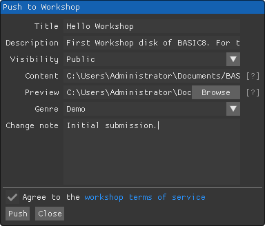
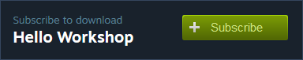
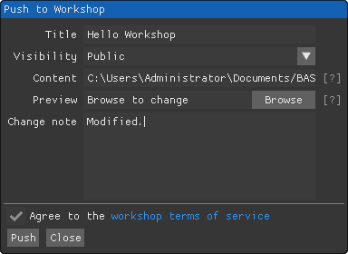
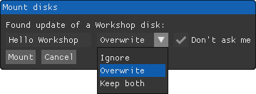

## Sharing via Workshop

You can share your creative disk with the Steam community via Workshop, subscribe to play other people's game and program, and discuss or comment on any creation.

### Submitting

To submit a new disk to Workshop, select it, then click `Community`, `Workshop`, `Push`. You will be prompted to fill in some information as following:

Recommended to use good looking preview, choose proper genre, and write necessary introduction and notes to help people to get better acquainted with your submission. Then click the `Push` button to submit it, with agreeing to the terms of service. You may edit submitted information in browser later, including changing description, chaging visibility, updating preview images and videos, etc.

### Subscribing

Use any browser to explore the entire [BASIC8 Workshop](http://steamcommunity.com/app/767240/workshop/) on Steam to make subscriptions:

All subscribed disks will be automatically downloaded for mounting. Notice that you still have to subscribe to your own disk to keep it up to date, this is useful if you were cooperating with other people on a same project.

### Unsubscribing

Click `Unsubscribe` on an already subscribed disk in browser to stop following it.

Unsubscribe mounted disk when removing it with `Unsubscribe` option checked, otherwise it will be only removed from local storage:

### Pushing

When you want to push modifications of a submitted disk, select the disk, then click `Community`, `Workshop`, `Push`. You will be prompted with a (similar to submission) dialog :

Notice it will download and re-mount the disk after success of both submitting and pushing, so **make backup as possible before pushing**, especially when you were cooperating with others.

### Pulling

To check updating of a mounted disk manually, select it, click `Community`, `Workshop`, `Pull`. This will always prompt with a mounting dialog:

Choose proper operation for mounting downloaded disk, check `Don't ask me` to make it quiet and defaults the operation to current selection for future updating. You can change the quiet mounting operation later in the properties dialog of a disk.

All subscribed disks will be pulled for updating automatically when BASIC8 boots up. To pull all disks manually, click `Community`, `Workshop`, `Pull all`; or click `Force to pull all` with `Shift` key pressed to force it showing mounting options for all disks. It's required to get your Steam client set to "online" mode to download subscriptions.

### Dismounting

To make a disk to a normal local one by dismounting it, open the properties dialog of it, then click `Dismount`.

[HOME](#sharing-via-workshop)
