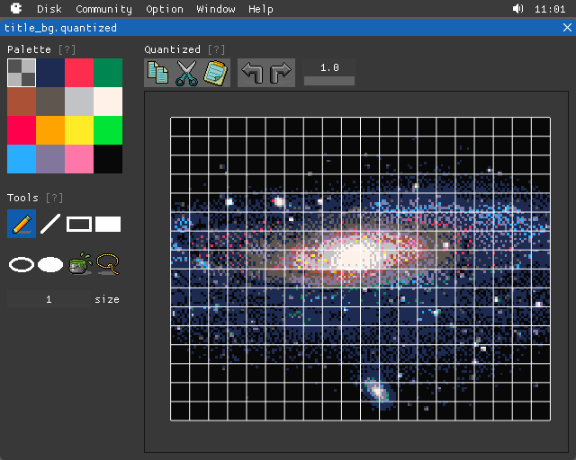
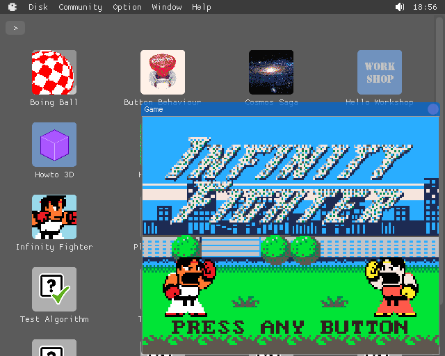
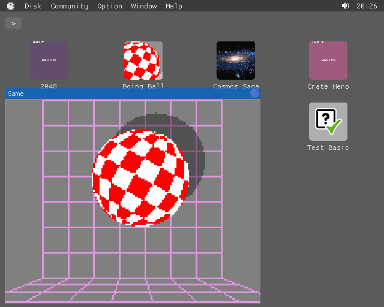

## Gallery

Create sprites:

Create maps:

Import and edit quantize images:

Write programs in BASIC, compose music, sound effects and speech:

Then mix all your work into a playable game, or a decent program:

Create, edit, import, export, and play sharable disks in an integrated environment:

