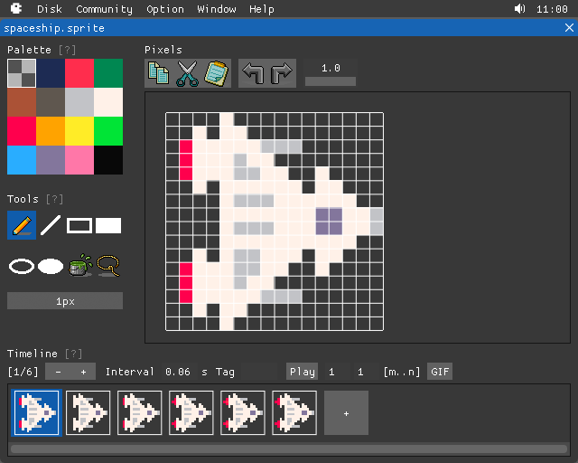
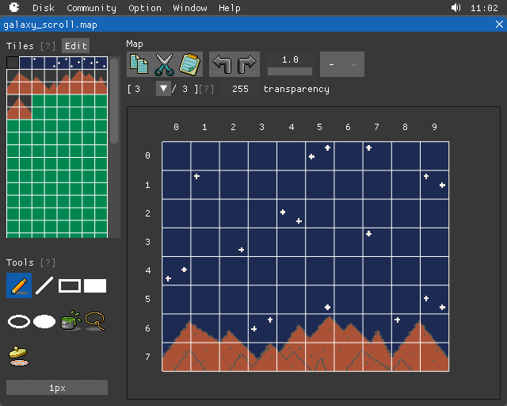
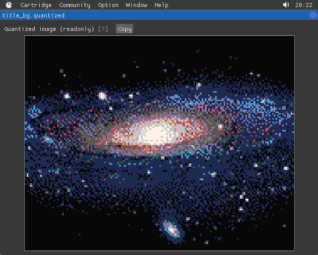
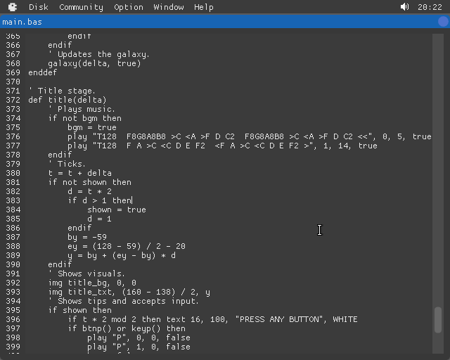
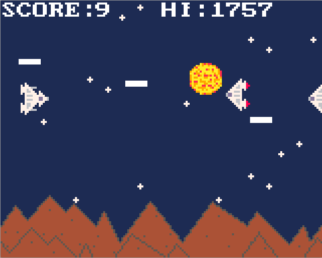
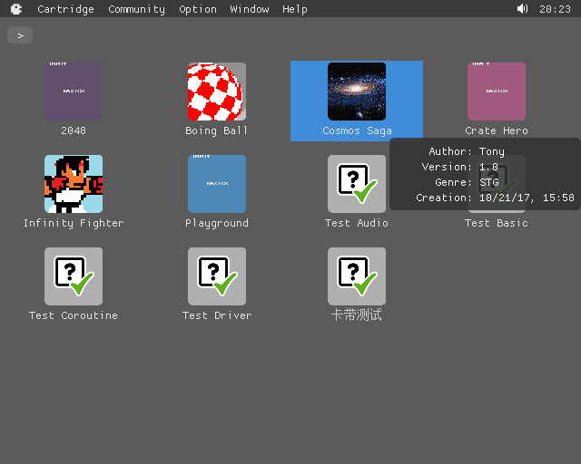
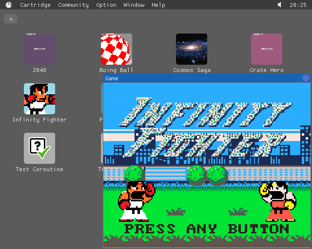

## Gallery

Create sprites with BASIC8:

create maps as well:

import and quantize images:

write programs in a BASIC dialect, in which music and sound effects are also written:

then mix all assets into a playable game, or a usable program:

user can create, edit, import, export, and play cartridges in an integrated environment:

